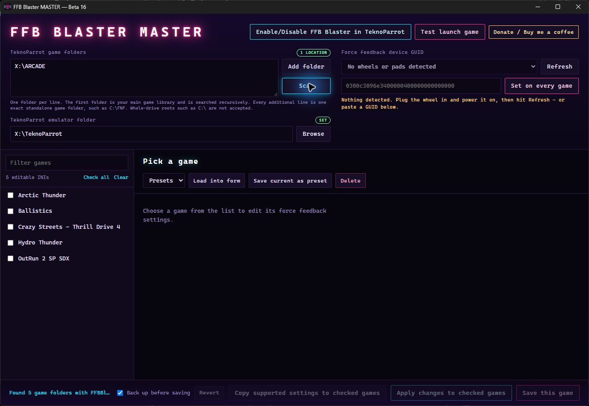

# FFB Blaster MASTER

A portable Windows app for managing FFB Blaster across a TeknoParrot arcade
library. It can:

- find each game's `FFBBlaster.ini` across an ordered list of approved game
  folders;
- show friendly game names from TeknoParrot `UserProfiles`;
- enable TeknoParrot's FFB Blaster switch for supported games;
- test-launch any FFB-enabled game to verify saved settings or let FFB Blaster
  generate its first INI;
- edit one game, selected games, or the whole library;
- find connected wheel/gamepad devices and create an SDL-style GUID;
- save reusable presets.



*Beta 16 with sample games. No wheel was connected to the capture PC.*

There is no installer. The EXE, settings, and presets can all live together in a
tools folder or on a USB drive.

On launch, a progress overlay identifies the current startup phase. The saved
**TeknoParrot game folders** are scanned automatically, so a large main library or
real-time antivirus checks can make the scan phase take longer than the others
without indicating a crash. The scan runs away from the window thread so the
progress animation remains live.

## Safest first beta test

1. Close `TeknoParrotUi.exe`. TeknoParrot can overwrite its profile XML when it
   exits.
2. Start `ffbblaster-master.exe` and leave **Back up before saving** checked.
3. In **TeknoParrot game folders**, put the main library containing the individual
   game folders on the first line. It is scanned recursively.
4. If a game must remain at a fixed path outside that library, put its exact folder
   on a later line. Enter one folder per line or use **Add folder**. Do not enter a
   whole-drive root such as `C:\`.
5. Set **TeknoParrot emulator folder** to the folder containing `TeknoParrotUi.exe`
   and its `UserProfiles` folder.
6. Click **Scan**. Open one test game, change one value, review the exact preview,
   and save it.
7. Confirm the game still launches and the wheel behaves as expected before using
   a bulk action.

## Games across multiple locations

The **TeknoParrot game folders** box is one ordered list. The first line is the main
games library and is scanned recursively. Every later line is an optional, exact
standalone game folder, which supports games that require fixed locations such as
`C:\FNF` or `C:\SuperCars`.

Blaster Master rejects a whole-drive root such as `C:\` on any line. Searching an
entire drive would be slow and would traverse unrelated applications and personal
files. Only the main library and the exact standalone folders you approve are
scanned.

The ordered list is saved in `ffbblaster-master.settings.json` beside the EXE and
restored on the next launch. Blank entries and path duplicates are removed
case-insensitively, and an INI reached through overlapping scan locations is listed
only once. Friendly names are matched against the normalized absolute `GamePath`
first, so games that share a nested folder name such as `rawart` are not confused
with one another. If an optional standalone folder is moved or temporarily
unavailable, the main library still loads and the status reports that the folder
was skipped.

The configured folders form the same explicit allowlist used by the targeted
first-INI watcher, old-plugin detection, and recoverable old-plugin quarantine.
A profile path outside the configured folders remains blocked.

During a scan, the app also looks for the superseded **FFB Arcade Plugin** package
under the configured game folders.
That older plugin can intercept the game before FFB Blaster gets a chance to create
`FFBBlaster.ini`. If a warning appears, open **Review old plugin files** and inspect
the exact files before confirming. Removal is recoverable: the app moves only the
detected package files into a timestamped `_FFBPlugin_legacy_backup_...` folder in
the same game folder. It does not permanently delete them. Generic wrapper names
such as `d3d9.dll` are included only when their embedded metadata identifies the
FFB Arcade Plugin.

The **Enable/Disable FFB Blaster in TeknoParrot** button lists TeknoParrot profiles
that support the switch. Enabling a profile does not create its settings file
immediately. Enable a small test set first, launch each newly enabled game through
TeknoParrot, and continue until actual gameplay begins so FFB Blaster initializes
and creates its `FFBBlaster.ini`. Reaching only the Press Start screen may be too
early. Exit the game and TeknoParrotUI, then scan again.
The main list counts editable INI files, not enabled TeknoParrot profiles.

After scanning, **Test launch game** lists every FFB-enabled profile and marks it
**INI ready** or **needs first launch**. INI-ready rows are shown with a darker,
quieter appearance so games still needing their first launch stand out, but they
remain selectable and launch normally for testing an existing configuration. For
a missing INI, enter gameplay briefly and the app watches that game's folder
automatically. When FFB Blaster creates `FFBBlaster.ini`, the game is added to the
editable list without a full library rescan and without disturbing another game's
unsaved form changes. Exit the launched game before editing its settings.
The launch command is restricted to XML files directly inside the selected
TeknoParrot `UserProfiles` folder.

If **Test launch game** is selected before a game-folder path has been configured
or before the library has been scanned, the app explains what is missing and
directs you back to **TeknoParrot game folders** and **Scan**. Blaster Master does
not create substitute INIs; FFB Blaster creates the correct game-specific file
after the game reaches actual gameplay.

When this copy of Blaster Master sees a writable `FFBBlaster.ini` for the first
time, it sets `disableInGameGui=1`, making **Hide in-game overlay** the initial
default. The INI path is then remembered in `ffbblaster-master.settings.json`.
Later changes to that game's checkbox are respected and are not forced back on.
The normal backup setting also applies to this one-time initialization.

When a game name is resolved from TeknoParrot XML, the main list shows only that
friendly name. Hover over it to see the complete folder path. Games without an
XML match continue to use their folder name as the title.

An automatically detected device GUID is marked as verified when it matches a GUID
already found in your game files. A newly derived GUID should be tested in one game
before choosing **Set on every game**.

Selecting a force-feedback device fills both the master GUID box and the open
game's **Device GUID** field. The game field remains an unsaved change until
**Save this game** is confirmed. **Set on every game** remains the separate,
explicit library-wide action.

The selected detected device is remembered immediately. Opening another game or
loading a preset automatically restores that device's GUID to the game form when
needed, so the device dropdown does not have to be toggled away and back.

## File safety

- INI and XML files are edited in place without reformatting the rest of the file.
- CRLF/LF style, UTF-8 BOM, comments, blank lines, key casing, and unknown INI keys
  are preserved.
- Invalid numbers, invalid GUIDs, read-only files, mixed line endings, and newline
  injection are blocked before writing.
- The confirmation window previews the real old and new value for every target.
- Writes use a synced temporary sibling followed by an atomic Windows replace.
- With backups enabled, timestamped `.bak` files are created beside the original.
- Files that already contain the requested value are not rewritten.
- Superseded plugin removal is signature-checked, limited to the configured game
  folder allowlist, and moved to a local backup folder rather than deleted.

Backups accumulate until removed manually. There is not yet a restore-backup button,
so keep backups enabled and restore by copying the desired `.bak` file over the
original only while TeknoParrot is closed.

## Build from source

Requirements: Windows 10/11, Rust 1.88 or newer with the MSVC toolchain, Visual
Studio C++ build tools, WebView2, and Tauri CLI 2.

```powershell
cd src-tauri
cargo test
cargo tauri build
```

The portable executable is
`src-tauri\target\release\ffbblaster-master.exe`. The frontend is plain HTML,
CSS, and JavaScript with no npm or bundler.

## Current beta limits

- Attached-device discovery is implemented from Windows Raw Input data, but needs
  confirmation with more physical wheel models.
- The exact meanings of `OutputsSystem` and `FeedbackLength` still need comparison
  with the installed FFB Blaster version.
- There is no always-on whole-library watcher, backup browser, updater, signing
  certificate, or installer yet. The targeted watcher used after **Test launch
  game** is temporary and stops when it finds that game's INI or reports an error.

## Support development

If FFB Blaster MASTER helps your cabinet and you would like to support continued
development, the in-app **Donate / Buy me a coffee** button opens the exact
[PayPal support page ($9.99)](https://www.paypal.com/paypalme/acbauer12/9.99) in
your default browser. Support is entirely optional and does not unlock features or
priority assistance. PayPal handles the payment on its own website; no payment
details or credentials enter the app.

## License

FFB Blaster MASTER is released under the [MIT License](LICENSE).
